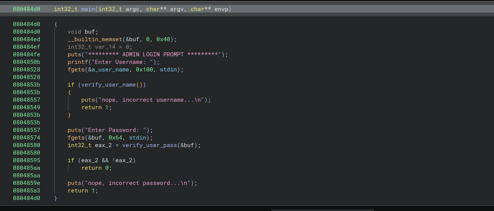
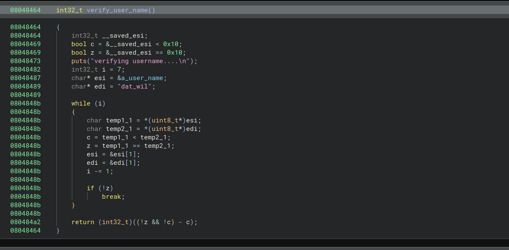
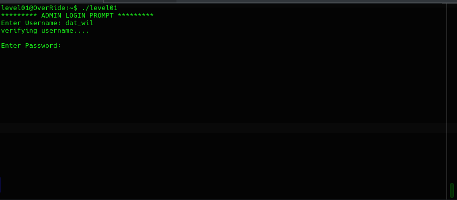
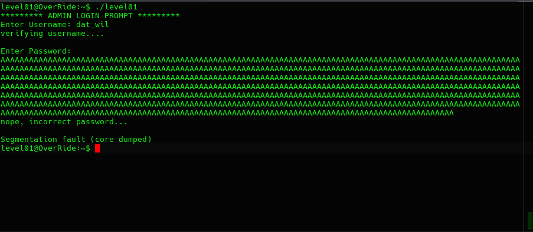
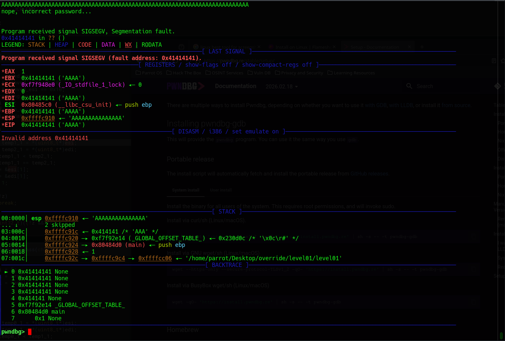
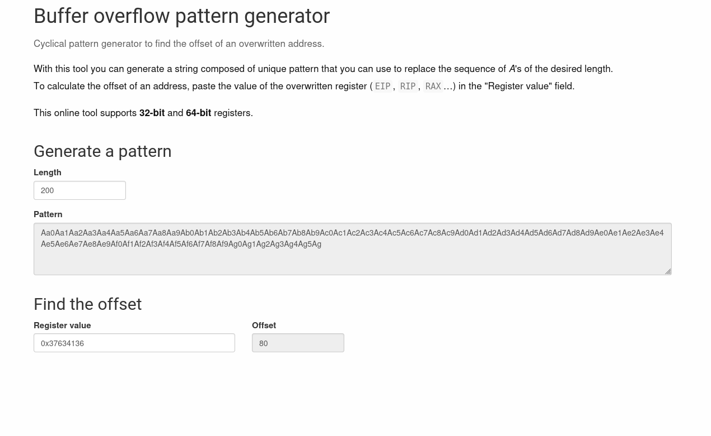
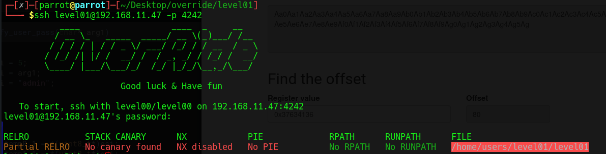

# Level01

Now the challenge begin.
We are provided with a second binary that ask for a username. anything we try just throw and error saying it's the incorrect username.

Let's import it into Binary Ninja.

As you can see the username is storred within a global variable using fgets then a function called verify_user_name is being called. Let's check this function.

We can see that a string is declared within this function with the value "dat_will". Let's try using it as a username.

It's seems this is the correct username. Let's not waste our time with the function username check.

Going back to the main function we see that in the next step.

The password with the lenght of 0x64 is bein read using fgets into a 0x40 size buffer.

Let's try overflowing this buffer.

Let's run the program through a run time debugger to see exactly what is happening.

We can see that the program exit with a SIGSEGV signal due to the invalid address 0x41414141.

So the Stack has been overflown to the point where the EIP register value got replaced.

And if we can control the EIP value we can control the flow of this program. all we have to do is to calculate the exact offset where our input start filling the EIP register then replace is with any address we wan't the program to execute.

The trick used here to calculate the offset is to generate a sequence of never repeating Bytes then inputing them into our buffer and examining the final EIP value.

As you can see in the figure 6 the offset is at 80 in this case.

From the information provided about the binary or using pwndbg we can see that NX security is disabled. NX is binary security feature that marks certain memory regions (such as the stack and heap) as non-executable.

In our case it's disabled which mean that any instruction we injected in the first bytes of our payload can be executed.

Let's generate a payload.

